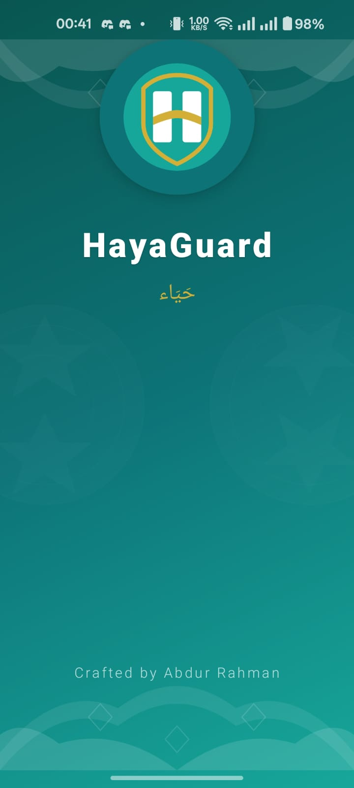
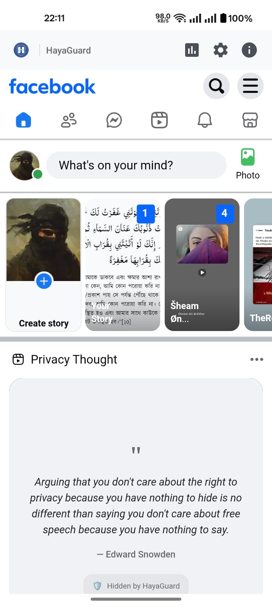
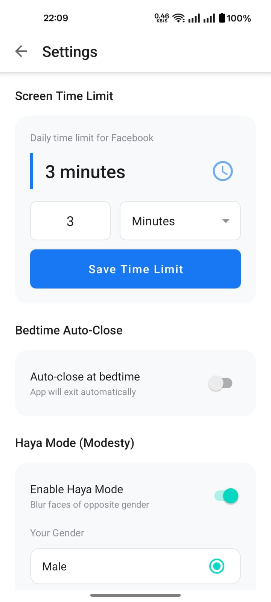
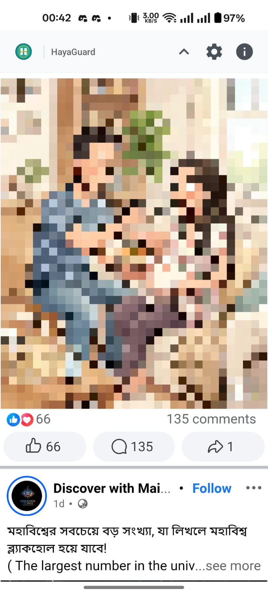
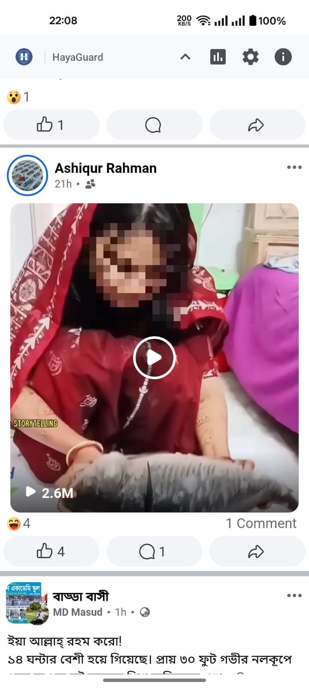
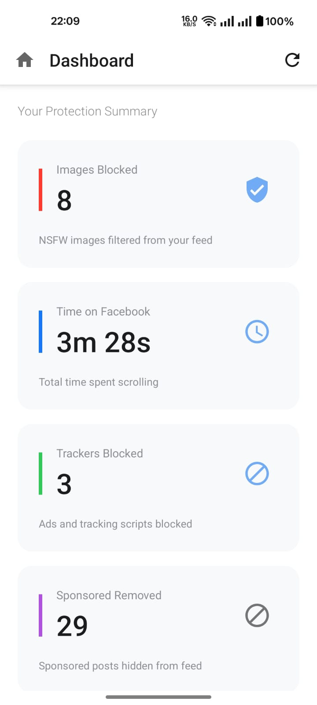
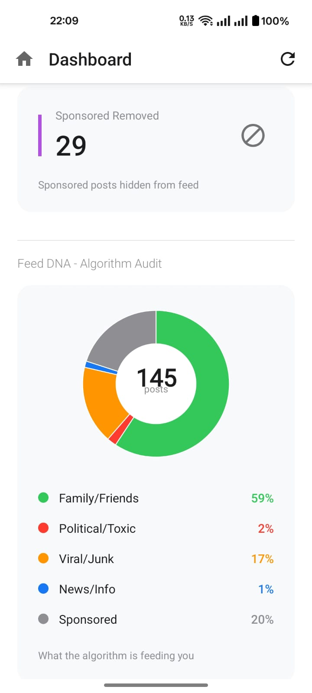
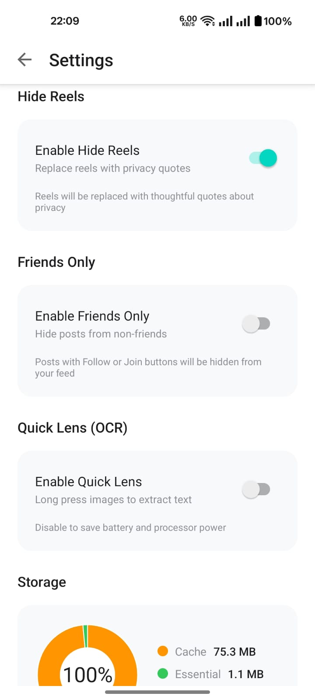

# HayaGuard

<p align="center">
  
</p>

<h1 align="center">HayaGuard</h1>

<p align="center">
  Privacy-focused Facebook client with on-device ML content filtering
</p>

<p align="center">
  
  [](https://github.com/System00-Security/HayaGuard/actions)
  [](https://www.gnu.org/licenses/gpl-3.0)
  [](https://android.com)
  [](https://patreon.com/0xrahmanmaheer)
</p>

---

HayaGuard is a privacy-focused Facebook client for Android that gives you complete control over your social media experience. It uses on-device machine learning to filter inappropriate content, block trackers, and provide transparency into your feed composition without sending any data to external servers.

## Screenshots

<p align="center">
  
  
  
</p>

<p align="center">
  
  
  
</p>

<p align="center">
  
  
  
</p>

## Features

- NSFW content detection using multi-stage ML pipeline
- Haya Mode for gender-aware face blurring
- Feed DNA analytics with multi-language support
- Comprehensive tracker and ad blocking
- Quick Lens OCR for text extraction
- Digital wellbeing controls
- 100% on-device processing

## Download

Download the latest APK from [GitHub Releases](https://github.com/System00-Security/HayaGuard/releases/latest).

| APK | Description |
|-----|-------------|
| arm64-v8a | Modern 64-bit ARM devices (recommended) |
| armeabi-v7a | Older 32-bit ARM devices |
| universal | All architectures (larger size) |

Enable installation from unknown sources and install.

## Build from Source

```bash
git clone https://github.com/System00-Security/HayaGuard.git
cd HayaGuard
./gradlew assembleRelease
```

## Contributing

Contributions are welcome. Please open an issue or submit a pull request.

### Ways to Contribute

- Report bugs and feature requests
- Improve ML model accuracy
- Add language support for Feed DNA
- Write documentation
- Test on different devices

### Guidelines

- Fork the repository and create a feature branch
- Follow Kotlin coding conventions
- Test your changes thoroughly
- Submit a pull request with clear description

## License

Copyright (C) 2025 System00 Security

This program is free software licensed under GPL v3. See [LICENSE](LICENSE) for details.

## Author

Abdur Rahman Maheer  
[](https://patreon.com/0xrahmanmaheer)
